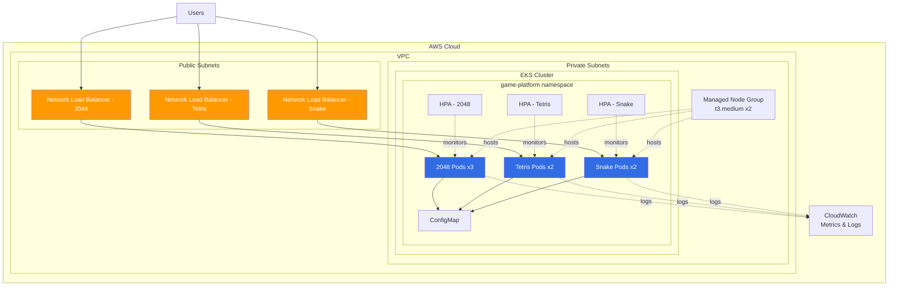

# 🎮 EKS Multi-Game Platform

> **A production-ready Kubernetes platform on Amazon EKS for deploying and managing multiple browser-based games**


## 📋 Table of Contents

- [Overview](#overview)
- [Features](#features)
- [Architecture](#architecture)
- [Prerequisites](#prerequisites)
- [Quick Start](#quick-start)
- [Deployment Options](#deployment-options)
- [Games Included](#games-included)
- [Configuration](#configuration)
- [Monitoring](#monitoring)
- [Troubleshooting](#troubleshooting)
- [Cost Estimation](#cost-estimation)
- [Customization](#customization)
- [Contributing](#contributing)
- [License](#license)

## 🌟 Overview

This project demonstrates a **production-grade Kubernetes deployment** on Amazon EKS, featuring multiple browser-based games with enterprise-level configurations including:

- **Multi-game deployment** (2048, Tetris, Snake)
- **Horizontal Pod Autoscaling** for dynamic resource management
- **Health checks** (liveness and readiness probes)
- **Resource limits** and requests for optimal performance
- **Infrastructure as Code** using Terraform
- **Automated deployment scripts** for easy setup
- **CloudWatch integration** for monitoring and logging

### What Makes This Project Unique?

✨ **Production-Ready**: Not just a basic demo - includes HPA, health checks, resource management, and proper namespacing  
✨ **Multi-Game Platform**: Deploy 3 different games instead of just one  
✨ **Fully Automated**: One-command deployment with comprehensive scripts  
✨ **Infrastructure as Code**: Complete Terraform configurations for reproducible infrastructure  
✨ **Well-Documented**: Extensive documentation with architecture diagrams and troubleshooting guides

## 🚀 Features

### Kubernetes Features
- ✅ **Deployments** with 3 replicas for high availability
- ✅ **LoadBalancer Services** for external access
- ✅ **Horizontal Pod Autoscaling** (HPA) based on CPU/memory
- ✅ **ConfigMaps** for centralized configuration
- ✅ **Namespaces** for resource isolation
- ✅ **Resource Quotas** and limits
- ✅ **Health Probes** (liveness and readiness)
- ✅ **Labels and Selectors** for organization

### AWS Features
- ✅ **EKS Cluster** with managed node groups
- ✅ **VPC** with public and private subnets
- ✅ **Network Load Balancers** for each game
- ✅ **IAM Roles** with least privilege access
- ✅ **CloudWatch** integration for metrics and logs
- ✅ **Auto Scaling Groups** for worker nodes

### DevOps Features
- ✅ **Terraform** for infrastructure provisioning
- ✅ **Automated deployment scripts** (Bash)
- ✅ **One-command setup** and teardown
- ✅ **Git-ready** with proper .gitignore
- ✅ **Comprehensive documentation**

## 🏗️ Architecture



## 📦 Prerequisites

Before you begin, ensure you have the following installed and configured:

### Required Tools
- **AWS CLI** (v2.x or later) - [Installation Guide](https://docs.aws.amazon.com/cli/latest/userguide/getting-started-install.html)
- **kubectl** (v1.28 or later) - [Installation Guide](https://kubernetes.io/docs/tasks/tools/)
- **eksctl** (v0.150 or later) - [Installation Guide](https://eksctl.io/installation/)
- **Terraform** (v1.0 or later) - [Installation Guide](https://developer.hashicorp.com/terraform/install)
- **Git** - [Installation Guide](https://git-scm.com/downloads)

### AWS Account Requirements
- Active AWS account with appropriate permissions
- IAM user with permissions to create:
  - EKS clusters
  - VPC and networking resources
  - EC2 instances
  - IAM roles and policies
  - Load Balancers
- AWS CLI configured with credentials:
  ```bash
  aws configure
  ```

### Verify Installation
```bash
# Check AWS CLI
aws --version

# Check kubectl
kubectl version --client

# Check eksctl
eksctl version

# Check Terraform
terraform version

# Verify AWS credentials
aws sts get-caller-identity
```

## 🚀 Quick Start

### Option 1: Automated Setup (Recommended)

```bash
# Clone the repository
git clone https://github.com/YOUR_USERNAME/eks-game-platform.git
cd eks-game-platform

# Make scripts executable
chmod +x scripts/*.sh

# Step 1: Create EKS cluster (takes ~15-20 minutes)
cd scripts
./setup-eks.sh

# Step 2: Deploy the games
./deploy.sh

# Step 3: Access your games
# The deploy script will display the LoadBalancer URLs
```

### Option 2: Manual Setup

```bash
# 1. Create EKS cluster using eksctl
eksctl create cluster \
  --name game-platform-eks \
  --region us-east-1 \
  --nodegroup-name game-platform-nodes \
  --node-type t3.medium \
  --nodes 2 \
  --nodes-min 1 \
  --nodes-max 4 \
  --managed

# 2. Configure kubectl
aws eks update-kubeconfig --region us-east-1 --name game-platform-eks

# 3. Install metrics server for HPA
kubectl apply -f https://github.com/kubernetes-sigs/metrics-server/releases/latest/download/components.yaml

# 4. Deploy the application
kubectl apply -f k8s/namespace.yaml
kubectl apply -f k8s/configmap.yaml
kubectl apply -f k8s/2048-deployment.yaml
kubectl apply -f k8s/tetris-deployment.yaml
kubectl apply -f k8s/snake-deployment.yaml
kubectl apply -f k8s/services.yaml
kubectl apply -f k8s/hpa.yaml

# 5. Wait for pods to be ready
kubectl wait --for=condition=ready pod -l app=game-2048 -n game-platform --timeout=300s

# 6. Get LoadBalancer URLs
kubectl get svc -n game-platform
```

### Option 3: Terraform Deployment

```bash
# Navigate to terraform directory
cd terraform

# Initialize Terraform
terraform init

# Review the plan
terraform plan

# Apply the configuration
terraform apply

# Configure kubectl
aws eks update-kubeconfig --region us-east-1 --name game-platform-eks

# Deploy applications
cd ../scripts
./deploy.sh
```

## 🎮 Games Included

### 1. 2048 - Classic Puzzle Game
- **Image**: `alexwhen/docker-2048`
- **Replicas**: 3
- **Port**: 80
- **Description**: Slide numbered tiles to combine them and reach 2048

### 2. Tetris - Block Puzzle
- **Image**: `bsord/tetris`
- **Replicas**: 2
- **Port**: 80
- **Description**: Classic falling block puzzle game

### 3. Snake - Classic Arcade
- **Image**: `potherca/docker-snake`
- **Replicas**: 2
- **Port**: 80
- **Description**: Navigate the snake to eat food and grow

## ⚙️ Configuration

### Resource Limits

Each game pod is configured with:
```yaml
resources:
  requests:
    memory: "128Mi"
    cpu: "100m"
  limits:
    memory: "256Mi"
    cpu: "200m"
```

### Autoscaling Configuration

- **Min Replicas**: 2
- **Max Replicas**: 8-10 (depending on game)
- **Target CPU Utilization**: 70%
- **Target Memory Utilization**: 80% (2048 only)

### Customizing Games

Edit `k8s/configmap.yaml` to modify game configurations:
```yaml
data:
  GAME_2048_TITLE: "Your Custom Title"
  PLATFORM_NAME: "Your Platform Name"
```

## 📊 Monitoring

### View Pod Status
```bash
kubectl get pods -n game-platform
kubectl get pods -n game-platform -w  # Watch mode
```

### View HPA Status
```bash
kubectl get hpa -n game-platform
kubectl describe hpa game-2048-hpa -n game-platform
```

### View Logs
```bash
# View logs for specific game
kubectl logs -n game-platform -l app=game-2048 --tail=50

# Follow logs in real-time
kubectl logs -n game-platform -l app=game-2048 -f
```

### CloudWatch Metrics
Access CloudWatch in AWS Console:
1. Navigate to CloudWatch > Container Insights
2. Select your EKS cluster
3. View CPU, Memory, Network metrics

## 🔧 Troubleshooting

### Pods Not Starting

```bash
# Check pod status
kubectl describe pod <pod-name> -n game-platform

# Check events
kubectl get events -n game-platform --sort-by='.lastTimestamp'

# Check logs
kubectl logs <pod-name> -n game-platform
```

### LoadBalancer Pending

```bash
# Check service status
kubectl describe svc <service-name> -n game-platform

# Verify AWS Load Balancer creation
aws elbv2 describe-load-balancers --region us-east-1
```

### HPA Not Scaling

```bash
# Check metrics server
kubectl get deployment metrics-server -n kube-system

# Check HPA status
kubectl describe hpa <hpa-name> -n game-platform

# Verify metrics are available
kubectl top pods -n game-platform
```

### Common Issues

| Issue | Solution |
|-------|----------|
| `ImagePullBackOff` | Check internet connectivity from nodes |
| `CrashLoopBackOff` | Check pod logs for application errors |
| `Pending` pods | Check node capacity and resource requests |
| LoadBalancer timeout | Verify security groups allow traffic on port 80 |

## 💰 Cost Estimation

### Monthly Costs (us-east-1)

| Resource | Cost |
|----------|------|
| EKS Cluster | $73.00 |
| EC2 Nodes (2x t3.medium) | $60.74 |
| Network Load Balancers (3x) | $48.60 |
| NAT Gateway | $32.40 |
| Data Transfer (estimated) | $10.00 |
| **Total** | **~$224.74/month** |

### Cost Optimization Tips

1. **Use Spot Instances** for worker nodes (~70% savings)
2. **Single NAT Gateway** instead of one per AZ
3. **Fargate** for serverless compute (pay per pod)
4. **Delete resources** when not in use
5. **Use t3.small** instances for testing

## 🎨 Customization

### Adding a New Game

1. Create deployment file `k8s/newgame-deployment.yaml`
2. Add service in `k8s/services.yaml`
3. Add HPA in `k8s/hpa.yaml`
4. Update ConfigMap with game configuration
5. Update deployment script

### Changing Node Instance Type

Edit `terraform/variables.tf`:
```hcl
variable "node_instance_type" {
  default = "t3.large"  # Change from t3.medium
}
```

### Enabling SSL/TLS

1. Request ACM certificate
2. Add certificate ARN to service annotations
3. Change service type to use ALB Ingress

## 🧹 Cleanup

### Delete Kubernetes Resources
```bash
cd scripts
./cleanup.sh
```

### Delete EKS Cluster
```bash
eksctl delete cluster --name game-platform-eks --region us-east-1
```

### Destroy Terraform Resources
```bash
cd terraform
terraform destroy
```

## 📝 License

This project is licensed under the MIT License - see the [LICENSE](LICENSE) file for details.

## 👤 Author

**Rishi**

- GitHub: [@YOUR_GITHUB_USERNAME](https://github.com/YOUR_GITHUB_USERNAME)
- LinkedIn: [Your LinkedIn](https://linkedin.com/in/your-profile)

## 🙏 Acknowledgments

- Original 2048 game concept
- Kubernetes community
- AWS EKS team
- Open source game container images

## ⭐ Show Your Support

If you found this project helpful, please give it a ⭐️!

---

**Built with ❤️ using Kubernetes, AWS EKS, and Terraform**
